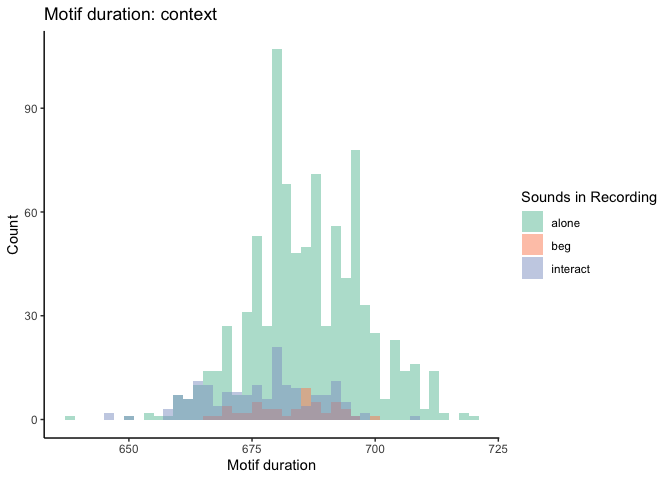
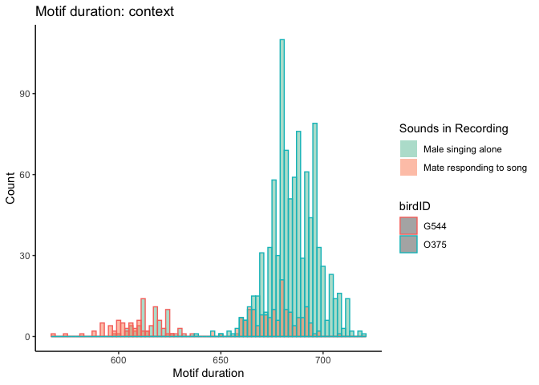
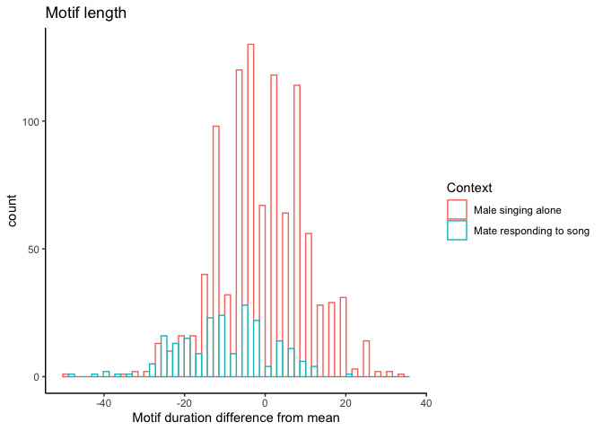
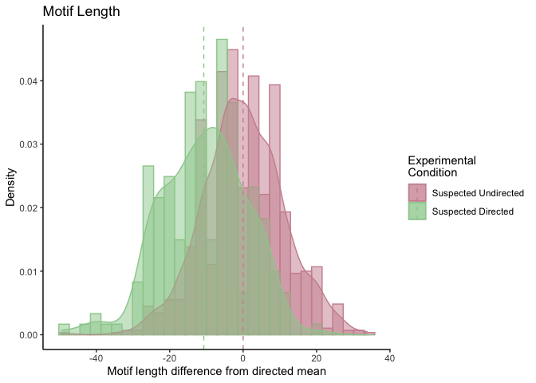
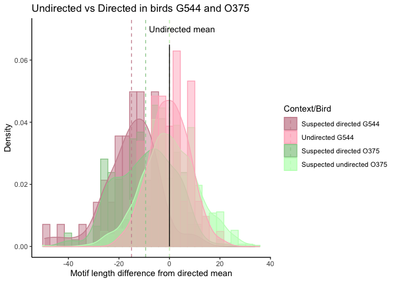
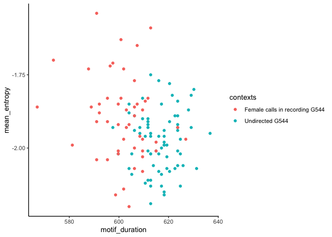
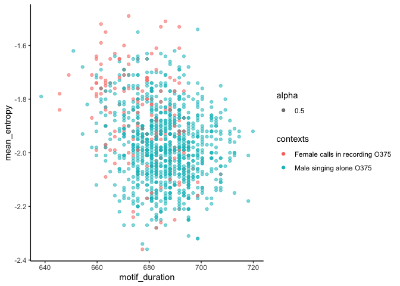

Birdsong analysis
================

This is an analysis of songs recorded from two zebra finches. Zebra
finche males sing to their mates during courtship. Previous studies have
found that males sing shorter (faster) songs to their mates (called
Directed song) than they are practicing alone (Undirected songs).

Here, I have audio files from males recorded while they were with their
mates. Noramally, we would know whether the songs are directed or
undirected from their behavior such as the direction they are facing and
whether or not they are dancing to their mate. However, there are no
videos recorded for this data.

### Question and hypothesis

Then, how do I figure out which ones are “directed” and which ones are
“undirected” songs?

I have noticed that some songs are sang while the females are making
calls. There are some indications from previous studies that females
like to respond to directed songs with calls.

**I hypothesize that the majority of songs recordings that are
contaminated with female calls are directed songs and the others are
undirected. **

If this is true, I expect songs with female calls to be shorter/faster
than songs with no calls.

## Preparing Data

Load and prepare data.

``` r
library(readxl)

birdsong_1 <- read_excel("~/Documents/Home 2020/birdsong_1.xlsx")
birdsong_2 <- read_excel("~/Documents/Home 2020/birdsong_2.xls")

# Combine data
data <- rbind(birdsong_1, birdsong_2)

# clean up data; get rid of durations that are too short to be songs 
new_data<- data[400 < data$motif_duration,]
birdsong2_filtered<- birdsong_2[400 < birdsong_2$motif_duration,]
```

## Preparing data/preliminary plot for Bird \#2

For bird2 (O375), songs were recorded when he was with his mate and
offspring, so some song audio files contain his mate’s calls and his
offsprings begging. I expect offspring begging to not make a difference.

``` r
library(ggplot2)
p <- ggplot(birdsong2_filtered, aes(motif_duration,fill=context2)) + geom_histogram(binwidth = 2, , alpha = 0.5, position = "identity") + ggtitle("Motif duration: context")+ xlab("Motif duration") +labs(fill = "Sounds in Recording")
p <- p + scale_fill_brewer(palette="Set2")
# get rid of grid
p <- p + theme_classic()
# label y axis
p <- p + ylab("Count")
p
```

<!-- -->

As expected, songs sang during begging calls do not seem to be shorter
in duration than males singing to themselves, so I decided to categorize
it as as male singing alone.

``` r
new_data[new_data == "alone"]<-"Male singing alone"
new_data[new_data == "interact"]<-"Mate responding to song"
new_data[new_data == "beg"]<-"Male singing alone"
```

For bird1 (G544), songs were recorded while he was completely alone and
when he was with a female. The songs while he was separated from his
mate can be safely assumed to be “directed”.

Plotting data to see how it
looks.

## Preliminary plot 2 to see how the overall distributions are for both birds

``` r
# plot data and see how it looks
p <- ggplot(new_data, aes(motif_duration,fill=context2, color=birdID)) + geom_histogram(binwidth = 2, , alpha = 0.5, position = "identity") + ggtitle("Motif duration: context")+ xlab("Motif duration") +labs(fill = "Sounds in Recording")
p <- p + scale_fill_brewer(palette="Set2")
# get rid of grid
p <- p + theme_classic()
# label y axis
p <- p + ylab("Count")
p
```

<!-- -->

It does look like the songs sung when females are calling are shorter in
duration than the songs male are singing to themselves.

Since these two birds have different song duration, I am normalizing
them to their “undirected” song or solo song recordings.

## Summarizing data

Looking at data summary and mean durations to normalize data.

``` r
# Need this library to summarize data. Load it.
library(Rmisc)
```

    ## Loading required package: lattice

    ## Loading required package: plyr

``` r
# Summary table. Call it df1.
df1 <- summarySE(new_data, measurevar = "motif_duration", groupvars=c("birdID", "context2"))
df1
```

    ##   birdID                context2   N motif_duration        sd        se
    ## 1   G544      Male singing alone  72       616.4928  7.723779 0.9102561
    ## 2   G544 Mate responding to song  49       601.4827 10.983288 1.5690412
    ## 3   O375      Male singing alone 938       686.0850 11.265243 0.3678232
    ## 4   O375 Mate responding to song 161       676.6679 11.415768 0.8996885
    ##          ci
    ## 1 1.8149992
    ## 2 3.1547687
    ## 3 0.7218527
    ## 4 1.7767963

## Normalizing data to the mean

Taking the difference from the mean.

``` r
# Count number of rows 
rows = 1:length(new_data$motif_duration)
# Create empty column
new_data[,"diff_frm_mean"] <- NA

# Extract means for undirected (alone) songs
G544undir_mean <- df1[1, 4]
O375undir_mean <- df1[3, 4]


# Add motif_duration-mean values in the new column. 
# If the bird is G544, substract G544 undirected mean, otherwise, substract O375's undirected mean.
for (r in rows){
  if (new_data$birdID[r] == "G544"){
    new_data$diff_frm_mean[r] <- new_data$motif_duration[r]-G544undir_mean
    } else { 
      new_data$diff_frm_mean[r] <- new_data$motif_duration[r]-O375undir_mean
  }
}
```

## Plot normalized grouped data

``` r
library(ggplot2)
p <- ggplot(new_data, aes(diff_frm_mean,color=context2)) + geom_histogram(fill = "white",position = "dodge") + ggtitle("Motif length")
p <- p + labs(color = "Context") + xlab("Motif duration difference from mean")
p <- p + theme_classic()
p
```

    ## `stat_bin()` using `bins = 30`. Pick better value with `binwidth`.

<!-- -->

## Plot density plot for grouped data

Density plot.

``` r
# Another way to summarize mean.
library(plyr)
mu2 <- ddply(new_data, "context2", summarise, grp.mean=mean(diff_frm_mean))
head(mu2)
```

    ##                  context2      grp.mean
    ## 1      Male singing alone -1.733607e-14
    ## 2 Mate responding to song -1.072208e+01

``` r
# Plot density
p <- ggplot(new_data, aes(x=diff_frm_mean, color=context2, fill=context2))
p <- p + geom_histogram(aes(y=..density..), position="identity", alpha=0.5) 
p <- p + geom_density(alpha=0.5)
p <- p + geom_vline(data=mu2, aes(xintercept=grp.mean, color=context2),linetype="dashed")
p <- p + scale_color_manual(values=c("pink3", "darkseagreen3"),name="Experimental\nCondition",
                            breaks=c("Male singing alone", "Mate responding to song"),
                     labels=c("Suspected Undirected", "Suspected Directed"))
p <- p + scale_fill_manual(values=c("pink3", "darkseagreen3"),name="Experimental\nCondition",
                    breaks=c("Male singing alone", "Mate responding to song"),
                    labels=c("Suspected Undirected", "Suspected Directed"))
p <- p + labs(title="Motif Length", y = "Density", x="Motif length difference from directed mean")
p <- p + theme_classic()
p
```

    ## `stat_bin()` using `bins = 30`. Pick better value with `binwidth`.

<!-- -->

Overall, for grouped data, the “undirected” songs (songs while male
singing alone)

## Run t-test

``` r
S_Undirected <- subset(new_data == "Male singing alone")
S_Directed <-subset(new_data == "Mate responding to song")

t.test(S_Undirected,S_Directed)
```

    ## 
    ##  Welch Two Sample t-test
    ## 
    ## data:  S_Undirected and S_Directed
    ## t = 27.421, df = 43996, p-value < 2.2e-16
    ## alternative hypothesis: true difference in means is not equal to 0
    ## 95 percent confidence interval:
    ##  0.02899953 0.03346429
    ## sample estimates:
    ##   mean of x   mean of y 
    ## 0.037630641 0.006398732

## Plot by bird

Plot by bird to see if this is the the case for ungrouped data. But
first, rename the data so that it’s clearer.

``` r
new_data[,"contexts"] <- NA
for (r in rows){
  if (new_data$birdID[r] == "G544" && new_data$context2[r] == "Male singing alone"){
    new_data$contexts[r] <- "Undirected G544"
  } else if (new_data$birdID[r] == "G544" && new_data$context2[r] == "Mate responding to song"){
    new_data$contexts[r] <- "Female calls in recording G544"
  } else if (new_data$birdID[r] == "O375" && new_data$context2[r] == "Mate responding to song"){
    new_data$contexts[r] <- "Female calls in recording O375"
  } else { 
    new_data$contexts[r] <- "Male singing alone O375"
  }
}


# Get a stats summary for density plot.
df2 <- summarySE(new_data, measurevar = "diff_frm_mean", groupvars=c("birdID", "contexts"))
df2
```

    ##   birdID                       contexts   N diff_frm_mean        sd        se
    ## 1   G544 Female calls in recording G544  49 -1.501011e+01 10.983288 1.5690412
    ## 2   G544                Undirected G544  72 -4.263256e-14  7.723779 0.9102561
    ## 3   O375 Female calls in recording O375 161 -9.417028e+00 11.415768 0.8996885
    ## 4   O375        Male singing alone O375 938 -1.538796e-14 11.265243 0.3678232
    ##          ci
    ## 1 3.1547687
    ## 2 1.8149992
    ## 3 1.7767963
    ## 4 0.7218527

``` r
# Density plot for each bird. Pink = G544, Green = O375; lighter color = undirected
# lighdarker color = directed
p <- ggplot(new_data, aes(x=diff_frm_mean, color=contexts, fill=contexts))
p <- p + geom_histogram(aes(y=..density..), position="identity", alpha=0.5) 
p <- p + geom_density(alpha=0.5)
p <- p + geom_vline(data=df2, aes(xintercept=diff_frm_mean, color=contexts),linetype="dashed")
p <- p + scale_color_manual(values = c("pink3", "pink1", "darkseagreen3", "darkseagreen1"), name = "Context/Bird",
                            breaks = c("Female calls in recording G544", "Undirected G544", "Female calls in recording O375", "Male singing alone O375"),
                            labels = c("Suspected directed G544", "Undirected G544", "Suspected directed O375", "Suspected undirected O375"))
p <- p + scale_fill_manual(values = c("pink3", "pink1", "darkseagreen3", "darkseagreen1"), name = "Context/Bird",
                            breaks = c("Female calls in recording G544", "Undirected G544", "Female calls in recording O375", "Male singing alone O375"),
                            labels = c("Suspected directed G544", "Undirected G544", "Suspected directed O375", "Suspected undirected O375"))
p <- p + labs(title="Undirected vs Directed in birds G544 and O375", y = "Density", x="Motif length difference from directed mean")
p <- p + annotate("segment", x = 0, y = 0, xend = 0, yend =0.065 )
p <- p + annotate("text", x = 5,y = 0.07, label = "Undirected mean" )
p <- p + theme_classic()
p
```

    ## `stat_bin()` using `bins = 30`. Pick better value with `binwidth`.

<!-- --> \#\#
Run stats by bird

``` r
# Run anova
anov <- aov(new_data$diff_frm_mean ~ new_data$contexts)
# output summary
summary(anov)
```

    ##                     Df Sum Sq Mean Sq F value Pr(>F)    
    ## new_data$contexts    3  21162    7054   57.27 <2e-16 ***
    ## Residuals         1216 149788     123                   
    ## ---
    ## Signif. codes:  0 '***' 0.001 '**' 0.01 '*' 0.05 '.' 0.1 ' ' 1

``` r
# Run tukey test for pairwise comparison
TukeyHSD(anov)
```

    ##   Tukey multiple comparisons of means
    ##     95% family-wise confidence level
    ## 
    ## Fit: aov(formula = new_data$diff_frm_mean ~ new_data$contexts)
    ## 
    ## $`new_data$contexts`
    ##                                                                       diff
    ## Female calls in recording O375-Female calls in recording G544 5.593083e+00
    ## Male singing alone O375-Female calls in recording G544        1.501011e+01
    ## Undirected G544-Female calls in recording G544                1.501011e+01
    ## Male singing alone O375-Female calls in recording O375        9.417028e+00
    ## Undirected G544-Female calls in recording O375                9.417028e+00
    ## Undirected G544-Male singing alone O375                       4.726990e-13
    ##                                                                      lwr
    ## Female calls in recording O375-Female calls in recording G544  0.9346463
    ## Male singing alone O375-Female calls in recording G544        10.8260244
    ## Undirected G544-Female calls in recording G544                 9.7223728
    ## Male singing alone O375-Female calls in recording O375         6.9813153
    ## Undirected G544-Female calls in recording O375                 5.3690297
    ## Undirected G544-Male singing alone O375                       -3.4916809
    ##                                                                     upr
    ## Female calls in recording O375-Female calls in recording G544 10.251520
    ## Male singing alone O375-Female calls in recording G544        19.194197
    ## Undirected G544-Female calls in recording G544                20.297849
    ## Male singing alone O375-Female calls in recording O375        11.852740
    ## Undirected G544-Female calls in recording O375                13.465026
    ## Undirected G544-Male singing alone O375                        3.491681
    ##                                                                   p adj
    ## Female calls in recording O375-Female calls in recording G544 0.0110487
    ## Male singing alone O375-Female calls in recording G544        0.0000000
    ## Undirected G544-Female calls in recording G544                0.0000000
    ## Male singing alone O375-Female calls in recording O375        0.0000000
    ## Undirected G544-Female calls in recording O375                0.0000000
    ## Undirected G544-Male singing alone O375                       1.0000000

As expected, songs with and without female calls in the background are
significantly different in duration.

## Conclusion

1.  For bird \#1 (G544), the songs that he sang while his mate was
    calling were overall shorter in duration than his undirected song.
2.  For bird \#2 (O375), while we don’t have recordings from him while
    he was alone, his song recording whithout the contamination of
    female calls were longer in duration than the songs sang while his
    mate was calling.

This suggest that we presence of female call contamination could be a
way to sort undirected vs. directed songs when visual analysis of
behavior cannot be done.

## Using Machine learning algorithm

Using Machine learning algorithm to see how different are the songs
during different contexts for each bird.

``` r
library(caret)
library(e1071)
birdsong1 <- subset(new_data, birdID == "G544")
index <- createDataPartition(birdsong1$contexts, p=0.75, list=FALSE)

# the data needs to be in a data frame or it wont work
birdsong1 <- as.data.frame(birdsong1)

# convert contexts column to factor
birdsong1$contexts <- as.factor(birdsong1$contexts)

data.training <- birdsong1[index,c(2:16,27,28)]
data.test <- birdsong1[-index,c(2:16,27,28)]

data.test <- as.data.frame(data.test )
```

Using KNN model to start.

``` r
# Train model

model_knn <- train(data.training[,1:16], data.training$contexts, method = 'knn',preProcess=c("center", "scale") )
predictions <- predict(object = model_knn, data.test[,1:16], type="raw")

resultstest <- data.test[,17]
confusionMatrix(predictions,resultstest)
```

    ## Confusion Matrix and Statistics
    ## 
    ##                                 Reference
    ## Prediction                       Female calls in recording G544 Undirected G544
    ##   Female calls in recording G544                              8               0
    ##   Undirected G544                                             4              18
    ##                                                         
    ##                Accuracy : 0.8667                        
    ##                  95% CI : (0.6928, 0.9624)              
    ##     No Information Rate : 0.6                           
    ##     P-Value [Acc > NIR] : 0.00151                       
    ##                                                         
    ##                   Kappa : 0.7059                        
    ##                                                         
    ##  Mcnemar's Test P-Value : 0.13361                       
    ##                                                         
    ##             Sensitivity : 0.6667                        
    ##             Specificity : 1.0000                        
    ##          Pos Pred Value : 1.0000                        
    ##          Neg Pred Value : 0.8182                        
    ##              Prevalence : 0.4000                        
    ##          Detection Rate : 0.2667                        
    ##    Detection Prevalence : 0.2667                        
    ##       Balanced Accuracy : 0.8333                        
    ##                                                         
    ##        'Positive' Class : Female calls in recording G544
    ## 

Looking at which variables contributed the most. We expect motif
duration to be ranked high.

``` r
importance <- varImp(model_knn, scale=FALSE)
print(importance)
```

    ## ROC curve variable importance
    ## 
    ##                    Importance
    ## start                  0.9364
    ## diff_frm_mean          0.8859
    ## motif_duration         0.8859
    ## mean_entropy           0.6584
    ## mean_AM2               0.5696
    ## mean_amplitude         0.5688
    ## var_pitch_goodness     0.5631
    ## mean_FM                0.5603
    ## var_FM                 0.5551
    ## mean_pitch             0.5543
    ## var_entropy            0.5501
    ## var_pitch              0.5440
    ## var_mean_freq          0.5305
    ## var_AM                 0.5285
    ## mean_freq              0.5110
    ## mean_pitchgoodness     0.5050

As expected, motif duration is the most important variable other than
start time. Mean entropy is also expected to be different between the
two groups because isolated recordings are clean while recordings while
females are calling are messy (less clean) by definition.

## Plot data

Plot data to see how well the top two variables separate out the two
contexts.

``` r
# plot scatter

p <- ggplot(birdsong1, aes(x = motif_duration, y = mean_entropy, color=contexts))
p <- p + geom_point()
p <- p +  theme_classic()
p
```

<!-- -->

## Repeat for Bird \#2

``` r
birdsong2 <- subset(new_data, birdID == "O375")
index <- createDataPartition(birdsong2$contexts, p=0.75, list=FALSE)

# the data needs to be in a data frame or it wont work
birdsong2 <- as.data.frame(birdsong2)

# convert contexts column to factor
birdsong2$contexts <- as.factor(birdsong2$contexts)

data.training <- birdsong2[index,c(2:16,27,28)]
data.test <- birdsong2[-index,c(2:16,27,28)]

data.test <- as.data.frame(data.test )
```

Using KNN model to start.

``` r
# Train model

model_knn <- train(data.training[,1:16], data.training$contexts, method = 'knn',preProcess=c("center", "scale") )
predictions <- predict(object = model_knn, data.test[,1:16], type="raw")

resultstest <- data.test[,17]
confusionMatrix(predictions,resultstest)
```

    ## Confusion Matrix and Statistics
    ## 
    ##                                 Reference
    ## Prediction                       Female calls in recording O375
    ##   Female calls in recording O375                             10
    ##   Male singing alone O375                                    30
    ##                                 Reference
    ## Prediction                       Male singing alone O375
    ##   Female calls in recording O375                       6
    ##   Male singing alone O375                            228
    ##                                                         
    ##                Accuracy : 0.8686                        
    ##                  95% CI : (0.8228, 0.9063)              
    ##     No Information Rate : 0.854                         
    ##     P-Value [Acc > NIR] : 0.2790512                     
    ##                                                         
    ##                   Kappa : 0.2986                        
    ##                                                         
    ##  Mcnemar's Test P-Value : 0.0001264                     
    ##                                                         
    ##             Sensitivity : 0.25000                       
    ##             Specificity : 0.97436                       
    ##          Pos Pred Value : 0.62500                       
    ##          Neg Pred Value : 0.88372                       
    ##              Prevalence : 0.14599                       
    ##          Detection Rate : 0.03650                       
    ##    Detection Prevalence : 0.05839                       
    ##       Balanced Accuracy : 0.61218                       
    ##                                                         
    ##        'Positive' Class : Female calls in recording O375
    ## 

``` r
importance <- varImp(model_knn, scale=FALSE)
print(importance)
```

    ## ROC curve variable importance
    ## 
    ##                    Importance
    ## var_pitch              0.7396
    ## mean_pitch             0.7385
    ## mean_entropy           0.7301
    ## diff_frm_mean          0.7254
    ## motif_duration         0.7254
    ## mean_freq              0.6968
    ## mean_FM                0.6599
    ## start                  0.6509
    ## var_entropy            0.6435
    ## mean_pitchgoodness     0.6236
    ## mean_AM2               0.5905
    ## var_FM                 0.5796
    ## var_AM                 0.5770
    ## mean_amplitude         0.5434
    ## var_pitch_goodness     0.5362
    ## var_mean_freq          0.5191

``` r
# plot scatter

p <- ggplot(birdsong2, aes(x = motif_duration, y = mean_entropy, color=contexts, alpha=0.5))
p <- p + geom_point()
p <- p +  theme_classic()
p
```

<!-- -->

Just looking at how the accuracy changes with different k values.

``` r
set.seed(400)
ctrl <- trainControl(method="repeatedcv",repeats = 3) #,classProbs=TRUE,summaryFunction = twoClassSummary)
knnFit <- train(contexts ~ ., data = data.training, method = "knn", trControl = ctrl, preProcess = c("center","scale"), tuneLength = 20)

#Output of kNN fit
knnFit
```

    ## k-Nearest Neighbors 
    ## 
    ## 825 samples
    ##  16 predictor
    ##   2 classes: 'Female calls in recording O375', 'Male singing alone O375' 
    ## 
    ## Pre-processing: centered (16), scaled (16) 
    ## Resampling: Cross-Validated (10 fold, repeated 3 times) 
    ## Summary of sample sizes: 742, 743, 743, 743, 743, 743, ... 
    ## Resampling results across tuning parameters:
    ## 
    ##   k   Accuracy   Kappa    
    ##    5  0.8678931  0.3166127
    ##    7  0.8739856  0.3298714
    ##    9  0.8752002  0.3215701
    ##   11  0.8752050  0.3172134
    ##   13  0.8687352  0.2639186
    ##   15  0.8687304  0.2561074
    ##   17  0.8719581  0.2620352
    ##   19  0.8739760  0.2682446
    ##   21  0.8743824  0.2663855
    ##   23  0.8747840  0.2689027
    ##   25  0.8755873  0.2694413
    ##   27  0.8747744  0.2659874
    ##   29  0.8739711  0.2595351
    ##   31  0.8731630  0.2517275
    ##   33  0.8691029  0.2211056
    ##   35  0.8695143  0.2216859
    ##   37  0.8695045  0.2211877
    ##   39  0.8695094  0.2184148
    ##   41  0.8699110  0.2212034
    ##   43  0.8695045  0.2137866
    ## 
    ## Accuracy was used to select the optimal model using the largest value.
    ## The final value used for the model was k = 25.
